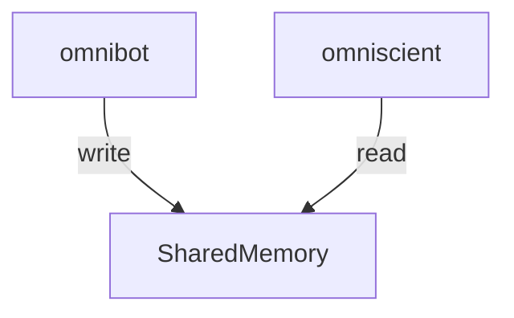

# omniscient

A pair program for the OmniBot that uses IPC and WebSockets to give us near
real-time updates from our bot

## what does it do?

the premise of this web app, is to read from shared memory from the bot



## shared memory structure

```c
typedef struct {
    // we'll check for version
    // number per update
    // seems jank but the other option
    // is to check for modified 0/1
    // but the rust code needs W perms
    // which i dont want
    int ver;
    int direction;
    int motor_power[3];
    // bot can be either
    // line following: 0
    // obstacle tracking/avoidance: 1
    // man control: 2
    int bot_mode;

    // osbtacle stuff
    int obstacle;

    // line following stuff
    int go_left;
    int go_right;
    int sensor_mode;

    int sensors[4];
} Shared;
```

## attribution

docker image inspo:\
[friday](https://github.com/JonasRSV/Friday)
