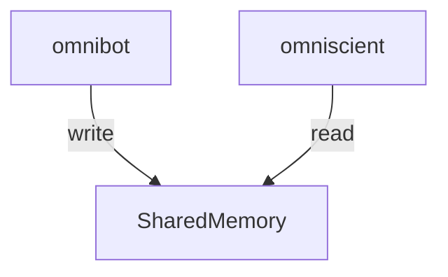

# omniscient

A pair program for the OmniBot that uses IPC and WebSockets to give us near
real-time updates from our bot

## what does it do?

the premise of this web app, is to read from shared memory from the bot



## shared memory structure

```c
typedef struct {

} Shared;
```
